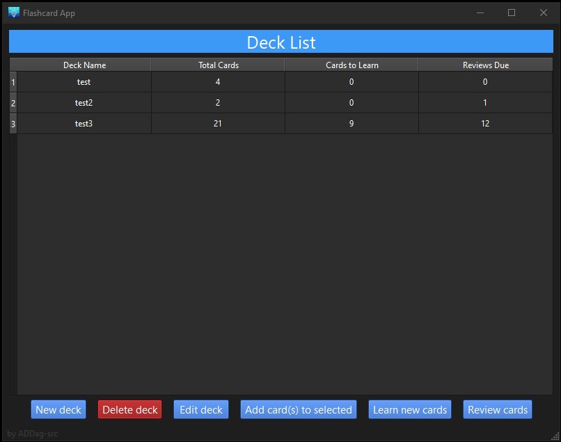
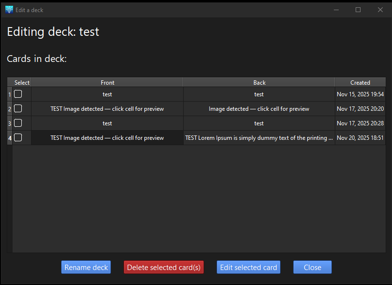
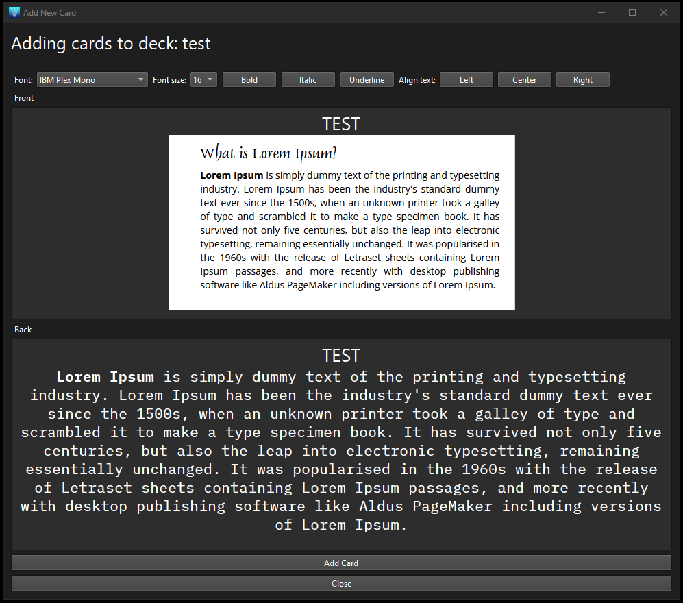
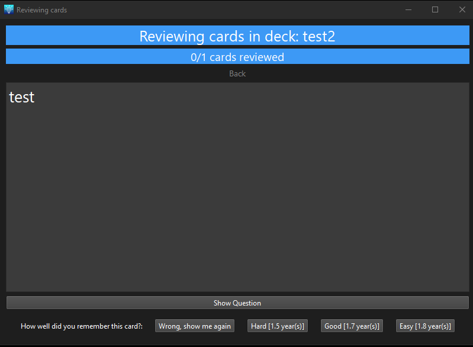

# Pyside6 Flashcard App
A flashcard app made with Pyside6 and SQL for database management.

## Features
- Create, edit, and delete decks and cards.
- Reviewing cards utilises the SM‑2 algorithm.
- Customize card appearance with detailed font and text options.
- Easily add images to cards with drag and drop support.
- Preview images and text while editing decks.
- Delete multiple cards at once with checkbox selection.
- Persistent SQL database storage for decks and cards.

## Review Scheduling
This app uses the [SM‑2 algorithm](http://super-memory.com/english/ol/sm2.htm) for adaptive review scheduling.  
Intervals adjust based on recall quality to improve long‑term memory retention.

## Screenshots

### Main Window


### Deck Editor


### Add Card Window


### Review Window


## Installation

- Clone the repository.
- Open the project in your preferred IDE.
- Install the required packages.
- Run the app by launching main.py


## Packaging
To package the project using PyInstaller, first make sure it is installed.
Run the following command from the project folder:

Windows(Tested):
```
pyinstaller --name=FlashcardApp --noconsole --icon="icons/app-icon.ico" --add-data "icons/*.ico;icons" --add-data "icons/*.png;icons" --add-data "windows/*.py;windows" main.py

```

Linux(Tested)/Mac(Not tested)

```
pyinstaller --name=FlashcardApp --noconsole --icon="icons/app-icon.png" --add-data "icons/*.ico:icons" --add-data "icons/*.png:icons" --add-data "windows/*.py:windows" main.py

```

## Credits & Thanks
- Algorithm SM‑2 © SuperMemo World, 1991. See [SuperMemo](https://www.supermemo.com) for details.  
- Icon sourced from [UXWing](https://uxwing.com/idea-icon/).
